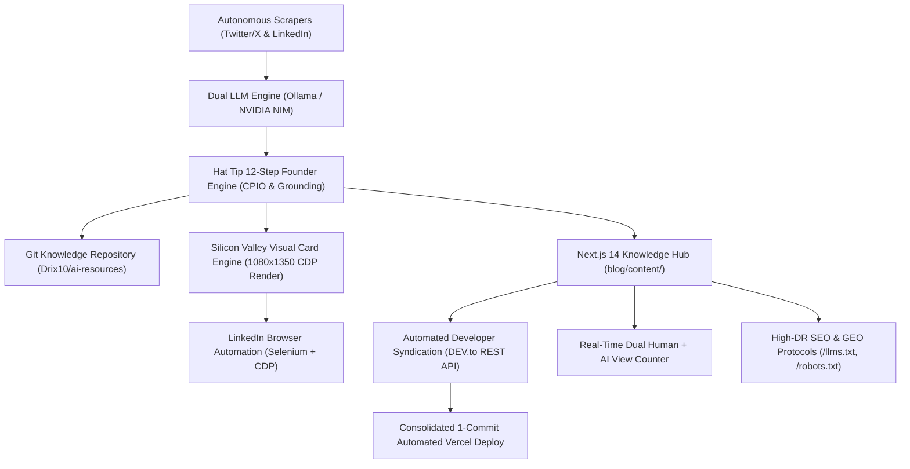

<p align="center">
  
</p>

<h1 align="center">⚡ Autonomous AI Knowledge & Multi-Channel Syndication Engine</h1>

<p align="center">
  <strong>Continuous Technical Curation • Dual-Engine LLM Pipeline • Next.js Knowledge Hub • Automated DEV.to Syndication</strong>
</p>

<p align="center">
  <a href="https://blogs.drix10.com"></a>
  
  
</p>

<p align="center">
  
  
</p>

---

## 📖 Overview

**ai-resources-pipeline** is an autonomous system that curates AI engineering updates, synthesizes structured technical breakdowns via local LLMs, and powers a **sub-second Next.js 14 Knowledge Hub** ([blogs.drix10.com](https://blogs.drix10.com)) with automated DEV.to syndication.

---

## 🏛️ System Architecture



---

## ✨ Key Features

### 👔 1. Hat Tip 12-Step Founder LinkedIn Engine
- **Strategic Buyer Question Extraction**: Mines technical breakthroughs to formulate exact questions, architectural tradeoffs, and failure modes facing engineering leaders.
- **Monthly Funnel Mix Balancing (40/40/20)**: Automatically tracks history (`recent-funnel-buckets.json`) and balances the monthly calendar mix (40% TOF, 40% MOF, 20% BOF).
- **CPIO Blueprint Formulation**: Explicitly maps **Convey**, **Package** (curiosity-gap hooks), **Information** (fact density), and **Order** (setup $\rightarrow$ development $\rightarrow$ principles) prior to drafting.
- **Deterministic Fact Grounding & Editorial Filter**:
  - Enforces $\ge$50% fact-grounding coverage from curated source points.
  - Guarantees plain-text formatting (strictly 0 markdown bold asterisks `**`).
  - Filters out reversal framing, rhetorical questions, weak survey CTAs, and banned buzzwords.
  - Multi-attempt feedback retry loop that unmasks true computed quality scores.

### 🎨 2. Silicon Valley Blueprint Slide Card Engine (`1080x1350`)
- **Pixel-Perfect 4:5 Aspect Ratio**: Optimized for mobile LinkedIn feeds to maximize visual real estate without clipping.
- **Chrome DevTools Protocol (CDP)**: Uses `Emulation.setDeviceMetricsOverride` and `Page.captureScreenshot` to render and capture at native resolution regardless of host monitor height.
- **Grounded Metrics & Structure Badges**: Displays only verified quantifiable metrics (`%`, `Nx`, `ms` speedups) with zero fabricated marketing claims, accompanied by dynamic structure badges (`SYSTEMS_FRAMEWORK`, `FOUNDER_CASE_STUDY`, `PERFORMANCE_AUDIT`, `CONTRARIAN_ANALYSIS`).
- **Fail-Safe Resource Management**: Unconditional temp image cleanup on exit, automatic stale file sweeping, and graceful text-only degradation if image upload encounters transient issues.

### ⚡ 3. High-Speed Next.js 14 Knowledge Hub (`blog/`)
- **8,941 Verified Technical Guides** across **42 Specialized Domains**.
- **Sub-60ms In-Memory Search & Filtering** with tokenized search indexes (`blog/lib/articles-index.json`).
- **Hybrid Incremental Static Regeneration (ISR)**: Builds in under 8 seconds with zero worker timeouts.
- **Minimalist Mobile-First UI**: Dark zinc palette, swipeable topic carousel, touch-optimized pagination ($44px+$ targets), and clean avatar header.
- **Live Deployment**: Hosted at [https://blogs.drix10.com](https://blogs.drix10.com).

### 👁️ 4. Dual Human + AI Agent View Counter Engine
- **Real-Time Persistent Counter**: Tracks genuine visits on each reader page and across the global blog.
- **Automatic AI Bot Detection**: Identifies AI crawlers (`GPTBot`, `ClaudeBot`, `PerplexityBot`, `Google-Extended`, `Bytespider`, etc.) via `User-Agent`.
- **Sticky Header Live Badge**: Displays real-time total reads with a pulsing emerald activity indicator.

### 🛡️ 5. Enterprise Security & Anti-DDoS Architecture
- **Memory-Bounded Sliding Window Rate Limiting**: Max 60 POSTs/min on views and 180 queries/min on search.
- **Anti-Tampering Slug Whitelist**: Only indexed articles can receive view increments, preventing storage corruption.
- **Security Headers**: `X-Frame-Options: DENY`, `X-Content-Type-Options: nosniff`, `Referrer-Policy: strict-origin-when-cross-origin`.

### 🚀 6. Automated DEV.to Developer Syndication
- **DEV.to API Integration**: Automatically cross-posts new articles with canonical backlinks pointing to [https://blogs.drix10.com](https://blogs.drix10.com).
- **Single-Batch Deployments**: Rebuilds search indexes and triggers only 1 consolidated commit per cycle.

### 🌐 7. Programmatic SEO (pSEO) & Generative Engine Optimization (GEO)
- **`/llms.txt`**: Standardized Markdown context for LLM agents and answer engines (ChatGPT, Claude, Perplexity).
- **Triple-Stacked JSON-LD**: `TechArticle`, `BreadcrumbList`, and `SearchAction` schemas linking author credentials ([drix10.com](https://drix10.com) / LinkedIn).
- **Related Guides Graph**: Deep internal cross-linking to prevent orphan pages and optimize crawl depth.

---

## 🛠️ Tech Stack

- **Frontend / Web**: Next.js 14 (App Router), React 18, TypeScript, Tailwind CSS, Lucide Icons
- **Markdown Engine**: Zero-dependency Regex Parser, Marked, KaTeX math rendering
- **Automation**: Node.js, Selenium WebDriver, Node-Cron, Winston Logger
- **AI Synthesis**: Local Ollama (`gemma4`) / NVIDIA NIM API (`llama-3.2-11b-vision-instruct`)
- **Syndication**: DEV.to REST API, GitHub Octokit REST

---

## 🚀 Quick Start

### 1. Installation
```bash
git clone https://github.com/Drix10/ai-resources-pipeline.git
cd ai-resources-pipeline
npm install
cd blog && npm install && cd ..
```

### 2. Environment Setup (`.env`)
```env
# Base Domain
CANONICAL_BASE_URL=https://blogs.drix10.com

# GitHub Sync
GITHUB_PAT=your_github_personal_access_token
GITHUB_USERNAME=Drix10
GITHUB_REPONAME=ai-resources

# DEV.to Multi-Platform Automated Syndication
DEVTO_API_KEY=your_devto_api_key
DEVTO_AUTO_PUBLISH=true

# LLM Settings
USE_LOCAL_LLM=true
LOCAL_LLM_MODEL=gemma4:latest
```

### 3. Run Development Server
```bash
cd blog
npm run dev
# Open http://localhost:3000
```

### 4. Run Autonomous Pipeline
```bash
node index.js         # Start autonomous background scraping & syndication worker
node post-gen.js      # Generate LinkedIn post draft preview
node post-live.js     # Publish live post & custom slide to LinkedIn
```

---

## 📄 License
MIT License © 2026 [Drix10](https://drix10.com)
