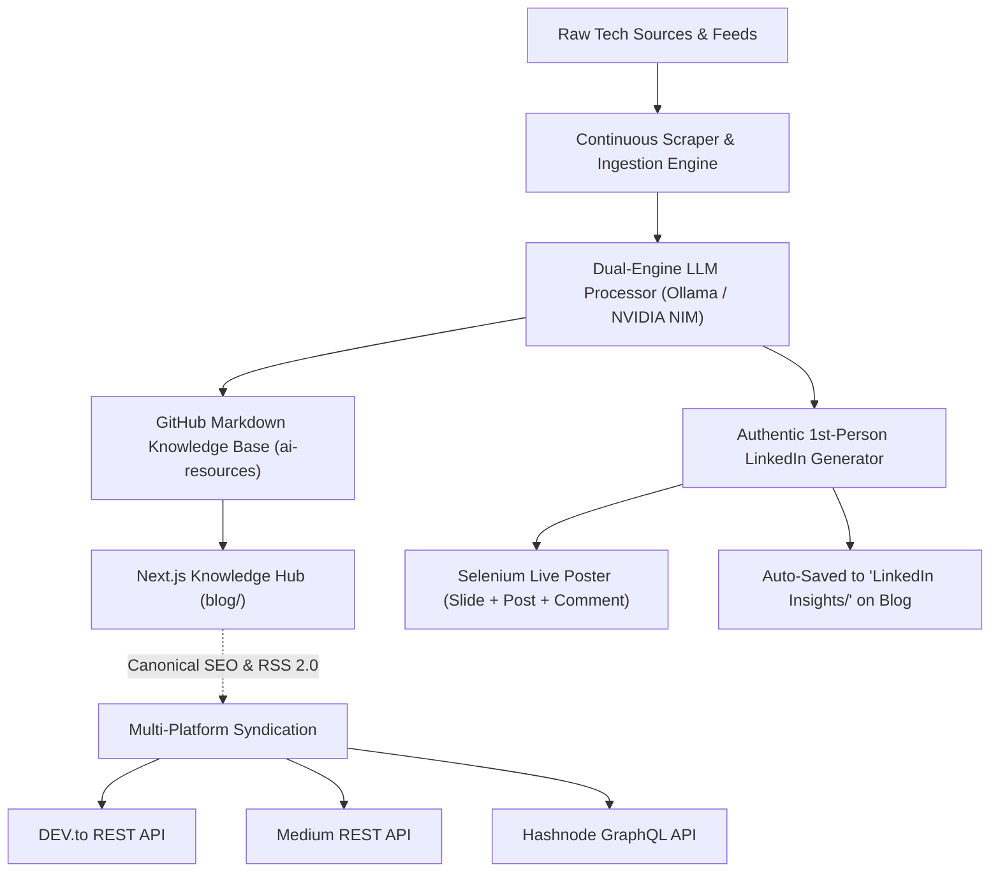

<div align="center">
  
  
  # ⚡ Autonomous AI Knowledge & Multi-Channel Syndication Engine

  <p align="center">
    <strong>Continuous Technical Curation • Dual-Engine LLM Pipeline • Next.js Knowledge Hub • Multi-Platform Developer Syndication</strong>
  </p>

  <p align="center">
    <a href="#-dual-engine-llm-infrastructure"></a>
    <a href="#-personal-knowledge-hub-nextjs-blog"></a>
    <a href="#-developer-platform-syndication"></a>
    <a href="#-automated-linkedin-storytelling"></a>
  </p>
</div>

---

## 📖 Overview

This repository powers an **end-to-end autonomous tech curation, knowledge base, and content syndication system**. 

It continuously ingests high-signal developer updates, filters and summarizes key engineering breakthroughs using local or cloud open-source LLMs, maintains a version-controlled Markdown knowledge repository on GitHub, compiles a modern **Next.js Knowledge Hub**, and syndicates curated insights across **DEV.to, Medium, Hashnode, and LinkedIn**.



---

## ✨ Key Capabilities

### 1. 🧠 Dual-Engine LLM Infrastructure
- **Local Ollama Support**: Autonomous local execution using `gemma4:latest` with automated daemon lifecycle management.
- **NVIDIA NIM Cloud API**: Ultra-fast inference with top open-source models (e.g. `meta/llama-3.2-11b-vision-instruct`) with sub-second response times.
- **Resilient Pipeline**: Automatic retry with exponential backoff on HTTP 429 rate limits, token sanitization, and structured JSON parsing.

### 2. 🌐 Next.js 14 Markdown Knowledge Hub (`blog/`)
- **Static Site Generation (SSG)**: Instantly compiles all markdown folders into a fast, responsive knowledge base.
- **Dynamic Routing**: Automatic category exploration, reading time calculations, and clean typography.
- **SEO & RSS**: Automated Google Sitemap (`/sitemap.xml`) and RSS 2.0 Feed (`/rss.xml`) generation.
- **1-Click Deployment**: Ready for instant zero-config deployment on Vercel or Cloudflare Pages.

### 3. 📡 Developer Platform Syndication (`src/services/syndication.js`)
- **Multi-Platform Cross-Posting**: Automatically distributes new breakdowns to **DEV.to**, **Medium**, and **Hashnode**.
- **Canonical URL Protection**: Attaches canonical links pointing back to your personal domain to guarantee **100% Google SEO rank retention**.

### 4. 💼 High-Performing LinkedIn Storytelling Engine
- **Authentic Student / Developer Voice**: First-person learning journey reflections based on genuine technical study (no AI hype or buzzwords).
- **Mandatory @Mentions**: Actively highlights and tags prominent tech organizations, companies, and mentors (e.g. `@Meta`, `@OpenAI`, `@Anthropic`, `@Google`, `@CynuxEra`).
- **Structured Takeaways**: Bold-header reflections formatted for high engagement.
- **Algorithmic Reach Strategy**: Zero em dashes, clean double spacing, rich 10-15 hashtag clouds, and links placed in the automated first comment.
- **Auto-Sync to Blog**: Every generated LinkedIn post is automatically published to the personal blog under `LinkedIn Insights`.

---

## 📂 Repository Structure

```
├── blog/                     # Next.js 14 App Router Personal Knowledge Hub
│   ├── app/                  # Routes: Home, /articles, /categories, /rss.xml, /sitemap.xml
│   ├── lib/markdown.ts       # Dynamic markdown scanner and metadata extractor
│   └── package.json          # Next.js & Tailwind CSS configuration
├── config/                   # Central application configuration & list mappings
│   └── index.js
├── src/
│   ├── services/
│   │   ├── cron.js           # Randomized UTC scheduling and automated workflows
│   │   ├── github.js         # GitHub repository committer & rate limit manager
│   │   ├── linkedin.js       # Selenium browser automation for LinkedIn publishing
│   │   ├── local-llm.js      # Dual LLM engine (Ollama & NVIDIA NIM) & virality formulas
│   │   ├── syndication.js    # Multi-platform API publisher (DEV.to, Medium, Hashnode)
│   │   └── twitter.js        # Headless authenticated data ingestion
│   └── utils/
│       └── helpers.js        # Logging, retry utilities, and sanitizers
├── post-gen.js               # CLI generator: Topic selection, hook scoring & blog preview
├── post-live.js              # Production live runner: Selenium slide generator & LinkedIn poster
└── .env                      # Environment configuration
```

---

## 🚀 Quick Start Guide

### Prerequisites
- **Node.js**: `v18.0.0+`
- **npm**: `v9.0.0+`
- **Ollama** (optional for local mode) or **NVIDIA API Key** (for cloud mode)
- **Chrome / Chromium** (for authenticated scraper & LinkedIn Selenium poster)

### 1. Installation

```bash
# Clone the repository
git clone https://github.com/Drix10/Twitter-Gemini-GitHub-MVP.git
cd Twitter-Gemini-GitHub-MVP

# Install root dependencies
npm install

# Install blog dependencies
cd blog && npm install && cd ..
```

### 2. Environment Setup

Configure your `.env` file in the root directory:

```env
# --- LLM Engine Configuration ---
LOCAL_LLM=false                          # Set to 'true' for local Ollama, 'false' for NVIDIA NIM
LOCAL_LLM_BASE_URL=http://127.0.0.1:11434
LOCAL_LLM_MODEL=gemma4:latest

# --- NVIDIA NIM Cloud API (when LOCAL_LLM=false) ---
NVIDIA_API_KEY=your_nvidia_api_key_here
NVIDIA_MODEL=meta/llama-3.2-11b-vision-instruct
NVIDIA_BASE_URL=https://integrate.api.nvidia.com/v1

# --- GitHub Repository Sync ---
GITHUB_PAT=your_github_personal_access_token
GITHUB_USERNAME=your_github_username
GITHUB_REPONAME=ai-resources

# --- Multi-Platform Syndication (Optional) ---
CANONICAL_BASE_URL=https://yourdomain.com
DEVTO_API_KEY=your_devto_api_key
DEVTO_AUTO_PUBLISH=false
MEDIUM_TOKEN=your_medium_token
MEDIUM_AUTO_PUBLISH=false
HASHNODE_TOKEN=your_hashnode_token
HASHNODE_PUBLICATION_ID=your_hashnode_pub_id
HASHNODE_AUTO_PUBLISH=false

# --- Social & Alerts ---
LINKEDIN_POST=true
DISCORD_WEBHOOK_URL=your_discord_webhook_url
```

---

## 💻 Available Commands

| Command | Description |
| :--- | :--- |
| `node post-gen.js` | Runs the AI curation pipeline, scores hooks, generates a LinkedIn draft, and saves a blog article preview. |
| `node post-live.js` | Generates the post, renders companion HTML slide graphics, posts live to LinkedIn, and publishes to the blog. |
| `npm run start` | Starts the automated background ingestion daemon with scheduled cron intervals. |
| `npm run list` | Runs the single-list live tracker with Discord webhook broadcasting. |
| `cd blog && npm run dev` | Launches the local Next.js Knowledge Hub at `http://localhost:3000`. |
| `cd blog && npm run build` | Runs a static production build of the Next.js Knowledge Hub. |

---

## 🌐 Deploying the Knowledge Hub

Deploy your personal knowledge base to **Vercel** in seconds:
1. Push your repository to GitHub.
2. Go to [Vercel](https://vercel.com) $\rightarrow$ **Add New Project** $\rightarrow$ Import this repo.
3. Set **Root Directory** to `blog`.
4. Click **Deploy**! Any new Markdown files committed by the pipeline will automatically trigger instant incremental builds.

---

## 📄 License

This project is licensed under the [GNU AGPLv3](https://choosealicense.com/licenses/agpl-3.0/) License.
