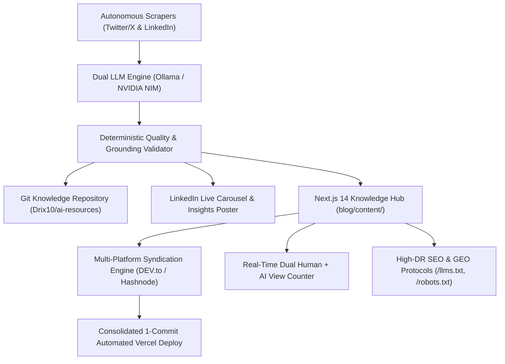

# 🚀 ai-knowledge-pipeline

> **Autonomous AI Knowledge Curation, Multi-Platform Syndication & High-Performance Next.js Knowledge Hub**

An enterprise-grade, autonomous pipeline that collects high-signal AI engineering updates from Twitter/X and LinkedIn, synthesizes structured technical breakdowns via local and cloud LLM engines, publishes to an authoritative Git-backed Knowledge Base, and powers a **sub-second Next.js 14 Knowledge Hub** (`blogs.drix10.com`) with automated multi-platform cross-posting (DEV.to / Hashnode).

---

## 🏛️ System Architecture



---

## ✨ Key Features

### ⚡ 1. High-Speed Next.js 14 Knowledge Hub (`blog/`)
- **8,941 Verified Technical Guides** across **42 Specialized Domains**.
- **Sub-60ms In-Memory Search & Filtering** with tokenized search indexes (`blog/lib/articles-index.json`).
- **Hybrid Incremental Static Regeneration (ISR)**: Builds in under 8 seconds with zero worker timeouts.
- **Minimalist Mobile-First UI**: Dark zinc palette, swipeable topic carousel, touch-optimized pagination ($44px+$ targets), and clean avatar header.

### 👁️ 2. Dual Human + AI Agent View Counter Engine
- **Real-Time Persistent Counter**: Tracks genuine visits on each reader page and across the global blog.
- **Automatic AI Bot Detection**: Identifies AI crawlers (`GPTBot`, `ClaudeBot`, `PerplexityBot`, `Google-Extended`, `Bytespider`, etc.) via `User-Agent`.
- **Sticky Header Live Badge**: Displays real-time total reads with a pulsing emerald activity indicator.

### 🛡️ 3. Enterprise Security & Anti-DDoS Architecture
- **Memory-Bounded Sliding Window Rate Limiting**: Max 60 POSTs/min on views and 180 queries/min on search.
- **Anti-Tampering Slug Whitelist**: Only indexed articles can receive view increments, preventing storage corruption.
- **Security Headers**: `X-Frame-Options: DENY`, `X-Content-Type-Options: nosniff`, `Referrer-Policy: strict-origin-when-cross-origin`.

### 🚀 4. Automated Multi-Platform Syndication
- **DEV.to API Integration**: Automatically cross-posts new articles with canonical backlinks pointing to `https://blogs.drix10.com`.
- **Hashnode GraphQL API**: Direct multi-platform broadcasting with tag sanitization and rate-limit spacing.
- **Single-Batch Deployments**: Rebuilds search indexes and triggers only 1 consolidated commit per cycle.

### 🌐 5. Programmatic SEO (pSEO) & Generative Engine Optimization (GEO)
- **`/llms.txt`**: Standardized Markdown context for LLM agents and answer engines (ChatGPT, Claude, Perplexity).
- **Triple-Stacked JSON-LD**: `TechArticle`, `BreadcrumbList`, and `SearchAction` schemas linking author credentials (`drix10.com` / LinkedIn).
- **Related Guides Graph**: Deep internal cross-linking to prevent orphan pages and optimize crawl depth.

---

## 🛠️ Tech Stack

- **Frontend / Web**: Next.js 14 (App Router), React 18, TypeScript, Tailwind CSS, Lucide Icons
- **Markdown Engine**: Zero-dependency Regex Parser, Marked, KaTeX math rendering
- **Automation**: Node.js, Selenium WebDriver, Node-Cron, Winston Logger
- **AI Synthesis**: Local Ollama (`gemma4`) / NVIDIA NIM API (`llama-3.2-11b-vision-instruct`)
- **Syndication**: DEV.to REST API, Hashnode GraphQL API, GitHub Octokit REST

---

## 🚀 Quick Start

### 1. Installation
```bash
git clone https://github.com/Drix10/ai-knowledge-pipeline.git
cd ai-knowledge-pipeline
npm install
cd blog && npm install && cd ..
```

### 2. Environment Setup (`.env`)
```env
# Base Domain
CANONICAL_BASE_URL=https://blogs.drix10.com

# GitHub Sync
GITHUB_PAT=your_github_personal_access_token
GITHUB_USERNAME=Drix10
GITHUB_REPONAME=ai-resources

# Syndication API Keys
DEVTO_API_KEY=your_devto_api_key
DEVTO_AUTO_PUBLISH=true
HASHNODE_TOKEN=your_hashnode_token
HASHNODE_PUBLICATION_ID=your_hashnode_publication_id
HASHNODE_AUTO_PUBLISH=true

# LLM Settings
USE_LOCAL_LLM=true
LOCAL_LLM_MODEL=gemma4:latest
```

### 3. Run Development Server
```bash
cd blog
npm run dev
# Open http://localhost:3000
```

### 4. Run Autonomous Pipeline
```bash
node index.js         # Start autonomous background scraping & syndication worker
node post-gen.js      # Generate LinkedIn post draft preview
node post-live.js     # Publish live post & custom slide to LinkedIn
```

---

## 📄 License
MIT License © 2026 [Drix10](https://drix10.com)